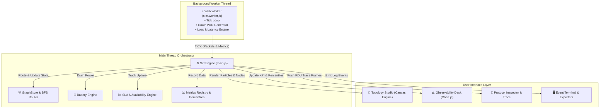

# 🌐 IoT Network Simulator

[](#-key-features)
[](#-coap-protocol-implementation)
[](#-system-architecture)
[](#-zero-build--offline-first-philosophy)
[](#)

An interactive, browser-native, zero-dependency real-time simulation and observability suite for Internet of Things (IoT) network topologies.

Built to model, visualize, stress-test, and inspect edge-to-cloud IoT infrastructure (**Sensors → Gateways → Servers**) operating over the **Constrained Application Protocol (CoAP - RFC 7252)** with real-time graph routing, packet drop/latency chaos injection, node energy models, SLA availability tracking, and Wireshark-style frame tracing.

---

## 📸 Overview & Workspaces

The simulator is organized into three dedicated workspaces accessible via the top tab bar or keyboard shortcuts (`1`, `2`, `3`):

1. **🧪 Topology Studio (`1`)**: Interactive HTML5 Canvas editor to add, drag, link, sever, and inspect nodes in real time with live particle animations, fault injection, and sidebar metrics.
2. **📊 Observability Desk (`2`)**: Executive dashboard featuring rolling 60s KPI cards (System Availability %, Active Nodes, Drops, Latency P50/P95/P99), throughput vs. packet loss charts, and node uptime state timelines.
3. **🔬 Protocol Inspector (`3`)**: Deep packet inspection view (PDU frame trace table) supporting CoAP message type filters (`CON`, `NON`, `ACK`), status filtering, full payload inspection, and multi-format log exports (CSV, JSON, Prometheus `.prom`).

---

## ✨ Key Features

- **⚡ Zero-Build & 100% Offline Ready**: No `npm`, `webpack`, `vite`, or CDN dependencies. Uses vanilla ES6 modules and a locally vendored build of Chart.js (`vendor/chart.umd.min.js`).
- **🧵 Multi-Threaded Worker Core**: Network tick generation, packet creation, and CoAP framing execute off the main thread via Web Workers (`workers/sim.worker.js`) to guarantee smooth 60 FPS canvas rendering.
- **📡 Native CoAP Protocol Support (RFC 7252)**:
  - 16-bit Message ID (MID) and 32-bit Token generation.
  - Automatic escalation from `NON` (Non-confirmable) to `CON` (Confirmable) on sensor alarm threshold breach (e.g. Temperature > 75°C, Pressure > 1060 hPa).
  - Stop-and-wait retransmission queue for `CON` messages.
- **🕸️ Dynamic Graph Routing**: Shortest-path Breadth-First Search (BFS) routing algorithm navigating around link cuts, node failures, and flapping paths.
- **🔋 Node Power & Battery Models**: Realistic battery depletion for edge sensors considering idle listen draw, transmit energy costs, fast-drain testing (10× mode), and node shutdown upon power exhaustion.
- **🚨 Gateway Queue & Flow Control**: Ring-buffer capacity management, drop-tail queueing, and queue depth visualization per gateway.
- **⚡ Network Chaos & Stress Testing**: Real-time packet loss injection (0–100%), base latency tuning (5–2000 ms), jitter variation (±ms), gateway kill fault injection (with 8s auto-restore), and traffic surge generation.
- **📈 Comprehensive Metrics & Exporting**: Real-time calculation of P50, P95, and P99 latency percentiles, SLA availability metrics, MTTR tracking, and standard Prometheus (`.prom`) metric exporter.

---

## 🏗️ System Architecture

The project follows a decoupled, event-driven architecture separating background simulation logic, topology graph state, rendering engine, and UI telemetry.



---

## 📂 Project Structure

```
IoT-Network-Simulator/
├── index.html               # Main SPA markup & workspace container shell
├── styles/                  # Clean modular CSS design system
│   ├── main.css             # Base reset, layout grid, topbar, HUD, tab bar
│   ├── studio.css           # Topology canvas, toolbar, drawer, terminal styles
│   └── dashboard.css        # Observability desk layout, KPI cards, charts
├── js/                      # Core JavaScript modules (vanilla IIFE pattern)
│   ├── main.js              # SimEngine orchestrator & tick dispatcher
│   ├── graph.js             # GraphStore: node/link topology & BFS pathfinding
│   ├── canvas.js            # CanvasEngine: HTML5 canvas rendering loop
│   ├── particles.js         # ParticleEngine: animated packet flow on links
│   ├── drag.js              # DragEngine: mouse/touch interactions & canvas tools
│   ├── coap.js              # CoAP protocol PDU framing & encoder/decoder
│   ├── battery.js           # BatteryEngine: node energy consumption & fast-drain
│   ├── gateway.js           # GatewayQueue: ring-buffer queue management
│   ├── telemetry.js         # TelemetryEngine: sensor data generation & thresholds
│   ├── chaos.js             # ChaosEngine: fault injection & loss/latency controls
│   ├── sla.js               # SLAEngine: uptime tracking, incident log & MTTR
│   ├── metrics.js           # MetricsRegistry: rolling window stats & percentiles
│   ├── trace.js             # TraceStore & TraceTable: packet frame tracer
│   ├── inspector.js         # Inspector drawer & PDU modal detail builder
│   ├── dashboard.js         # DashboardEngine: Observability desk KPI controller
│   ├── charts.js            # ChartEngine: Chart.js integrations & updates
│   ├── scenarios.js         # Preset topologies (Smart Factory, City, Wireless)
│   ├── terminal.js          # Terminal log & multi-format exporter handlers
│   └── ui.js                # UIController: topbar events, HUD & hotkey bindings
├── workers/                 # Web Worker threads
│   └── sim.worker.js        # Dedicated worker for simulation tick loop
└── vendor/                  # Bundled third-party libraries (Offline-first)
    └── chart.umd.min.js     # Chart.js UMD bundle (zero CDN dependency)
```

---

## 🚀 Getting Started

Because this project uses standard ES6 JavaScript and HTML5 with zero external dependencies, no installation or compilation step is required!

### 1. Clone the Repository
```bash
git clone https://github.com/joellijo32/IoT-Network-Simulator.git
cd IoT-Network-Simulator
```

### 2. Launch Local Web Server
To allow Web Workers to execute properly without CORS security restrictions on local file URIs (`file://`), serve the directory using any static web server:

**Using Python (3.x):**
```bash
python3 -m http.server 8000
```

**Using Node.js (`npx`):**
```bash
npx http-server -p 8000
```

**Using PHP:**
```bash
php -S localhost:8000
```

### 3. Open in Browser
Navigate to `http://localhost:8000` in any modern Web Browser (Chrome, Firefox, Edge, Safari).

---

## 🎮 How to Use

### Topology Studio Controls
- **▶ Start / ⏸ Pause**: Toggle the live simulation loop.
- **⏭ Step**: Advance the simulation by exactly 1 tick (800 ms) while paused.
- **Speed Multiplier**: Adjust tick speed (`0.5×`, `1×`, `2×`, `5×`).
- **Presets Dropdown**: Quickly load benchmark topologies:
  - 🏭 **Smart Factory**: High-density indoor sensor grid with gateway redundancy.
  - 📡 **Unstable Wireless**: Long-range links with higher loss rates & flapping routes.
  - 🌆 **Smart City**: Multi-hop edge-to-cloud mesh network.
  - 🧩 **Custom (Studio)**: Blank canvas to design custom networks.

### Interactive Canvas Tools
| Tool | Shortcut | Description |
| :--- | :---: | :--- |
| **Move / Select** | `V` | Drag nodes around the canvas; click a node to open its Inspector Drawer. |
| **+ Sensor** | — | Add a sensor node emitting telemetry (Temperature, Humidity, Pressure). |
| **+ Gateway** | — | Add an edge gateway with queuing and forwarding capability. |
| **+ Server** | — | Add a destination cloud/datacenter server node. |
| **🔗 Link** | `L` | Connect nodes: click source node then click target node. |
| **✂ Cut** | `X` | Click any link to toggle its state between `up` and `down` (sever/restore link). |
| **🗑 Del** | `Del` | Delete the currently selected node or link. |

### Keyboard Shortcuts
- `1`: Switch to **Topology Studio** view
- `2`: Switch to **Observability Desk** view
- `3`: Switch to **Protocol Inspector** view
- `Esc`: Close drawers, modals, or cancel active link drawing

---

## ⚡ Chaos Engineering & Fault Injection

Located in the left sidebar panel of the Topology Studio:

- **Packet Loss Rate Slider**: Inject 0% to 100% random packet drop probability.
- **Base Latency & Jitter Sliders**: Adjust baseline propagation delay and random jitter.
- **🔋 Fast-Drain Mode**: Accelerate sensor battery depletion by 10× to test network degradation as nodes die out.
- **💀 Kill Gateway**: Instantly force the primary active gateway into a `down` state for 8 seconds. Watch BFS routing dynamically re-route traffic through alternate gateways or mark packets as orphaned/dead.
- **🚨 Traffic Surge**: Spike emission rates across all active sensors for 6 seconds to stress-test gateway queue capacities and buffer overflows.

---

## 📊 Analytics & Export Formats

The simulator provides built-in tools for log extraction and telemetry exports:

1. **📥 CSV Export**: Downloads complete event log history as a `.csv` file.
2. **📥 JSON Export**: Export simulation event logs or full network topology definitions (`.json`).
3. **📥 Prometheus Metric Export (`.prom`)**: OpenMetrics snapshot containing standard Prometheus metric streams:
   - `iot_packets_sent_total`
   - `iot_packets_delivered_total`
   - `iot_packets_dropped_total`
   - `iot_network_loss_ratio`
   - `iot_network_latency_seconds`
   - `iot_gateway_queue_depth`
   - `iot_node_availability_ratio`

---

## 👥 Authors & Team Credits

Developed by Team lead **Joel Lijo Mathew** and project contributors:

- **Team Lead**: [Joel Lijo Mathew](https://github.com/joellijo32)
- **Team**: George · Abhiram · Naveen · Abhishek · Anand · Levin · Aditya · Jebin · Adithyan · Ameen

---

## 📄 License

This project is open-source and available under the [MIT License](LICENSE).
